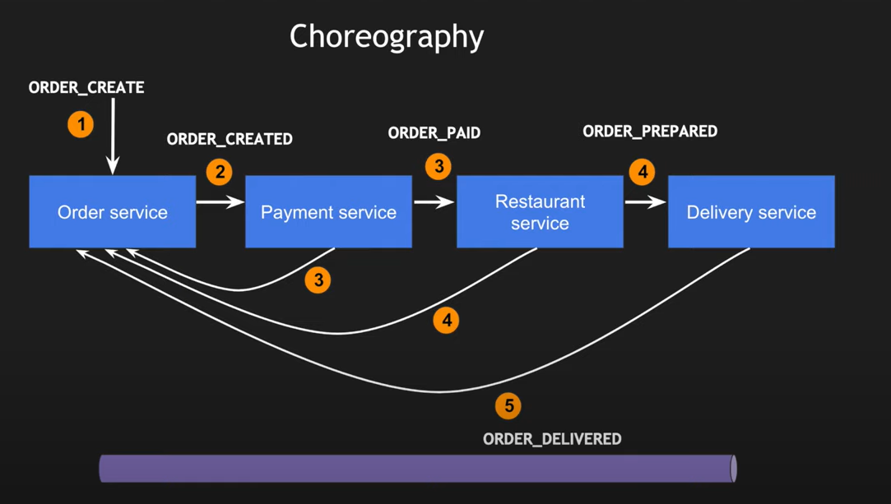
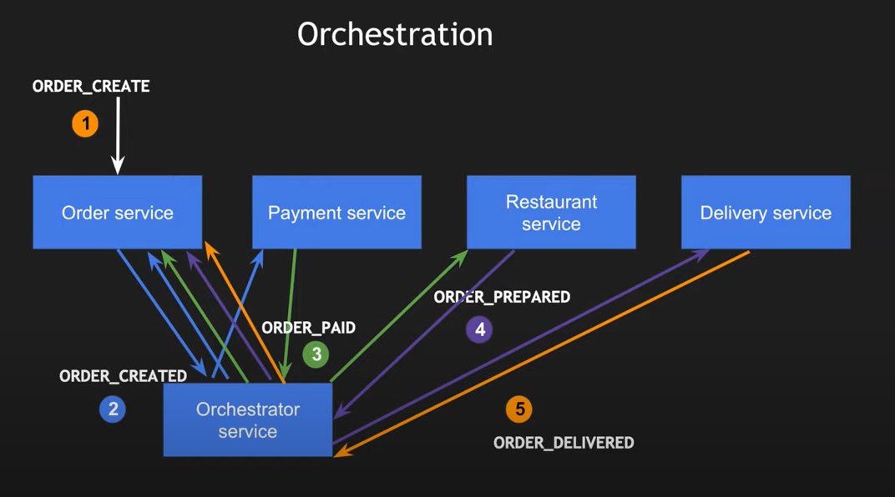

- [AmbientContextExamples](#ambientcontextexamples)
- [SOLID](#solid)
- [Adapter](#adapter)
- [Builder, Fluent Builder and  Fluent Interfaces](#builder-fluent-builder-and--fluent-interfaces)
- [Builder](#builder)
  - [Fluent Builder](#fluent-builder)
  - [Fluent Interfaces](#fluent-interfaces)
- [Specification](#specification)
- [SAGA](#saga)
  - [SAGA using Choreography](#saga-using-choreography)
  - [SAGA using Orchestration](#saga-using-orchestration)

# AmbientContextExamples

# SOLID
https://www.codeproject.com/Articles/703634/SOLID-architecture-principles-using-simple-Csharp
https://medium.com/@mirzafarrukh13/solid-design-principles-c-de157c500425

__S stands for SRP (Single responsibility principle)__:- A class should take care of only one responsibility. This principle supports also open closed principle.

__O stands for OCP (Open closed principle)__:- Extension should be preferred over modification.
Usually it is a problem of __switch/case__ statement. This can be achieved by using base class and not concrete classes.

__L stands for LSP (Liskov substitution principle)__:- A parent class object should be able to refer child objects seamlessly during runtime polymorphism.  It means that we should avoid things like __method not implemented exception__ in child class.   
We must make sure that new derived classes are extending the base classes without changing their behavior. If we are calling a method defined at a base class upon an abstracted class, the function must be implemented properly on the subtype class.   
This can be achieved by splitting problematic methods to different interfaces/classes.   
**If this principle is not used then we might get an error in runtime, if this principle is used then we will get the error during compilation.** 

__I stands for ISP (Interface segregation principle)__:- Client should not be forced to use a interface if it does not need it. For example if we extend existing interface we should think if it makes sense to add new function
in this interface or maybe it is better to create new interface or new version of current interface.

__D stands for DIP (Dependency inversion principle)__:- High level modules should not depend on low level modules but should depend on abstraction.
Entities must depend on abstractions not on concretions.   
It is called *Dependency inversion* because if a class uses some other classes/interfaces then the class does not decide about concrete type but external mechanism takes this responsibility and this mechanism also provides
actually instance of an object. This can be achieved by DI or by service locator.
IOC (Inversion of control) is a general parent term while DI (Dependency injection) is a subset of IOC. IOC is a concept where the flow of application is inverted.

# Adapter
https://www.dofactory.com/net/adapter-design-pattern

# Builder, Fluent Builder and  Fluent Interfaces

# Builder

* client (in this case it is ```BuilderUse``` class) does not care how the store is built in details, only the finished product is delivered to him

## Fluent Builder

* This pattern tells us to extract the object construction code out of its own class and put it in a separate object which we call a builder.
* Has ```Build``` method that should be called at the and of chain.

## Fluent Interfaces

* "A fluent interface is a method of designing object-oriented APIs based extensively on method chaining with the goal of making the readability of the source code to that of ordinary written prose, essentially creating a domain-specific language within the interface"


https://medium.com/@martinstm/fluent-builder-pattern-c-4ac39fafcb0b   
https://assist-software.net/blog/how-design-and-implement-fluent-interface-pattern-c   
https://medium.com/@sawomirkowalski/design-patterns-builder-fluent-interface-and-classic-builder-d16ad3e98f6c   
https://code-maze.com/builder-design-pattern/   

# Specification
https://enterprisecraftsmanship.com/posts/specification-pattern-c-implementation/

# SAGA

## SAGA using Choreography



## SAGA using Orchestration




